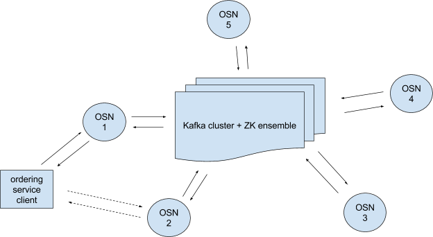
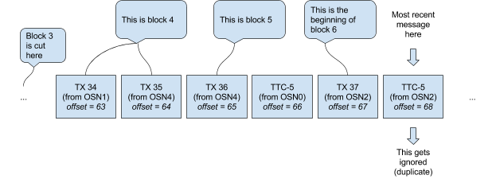
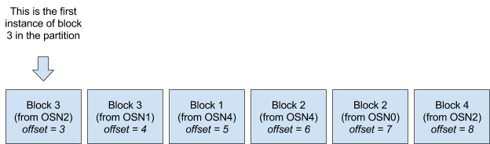
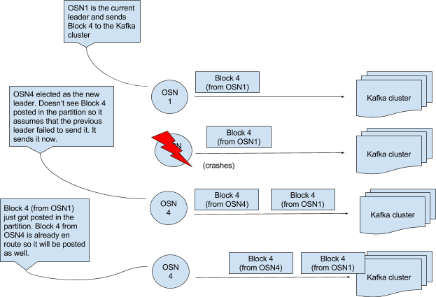
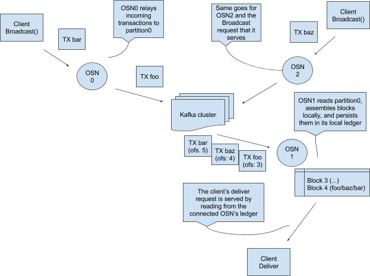
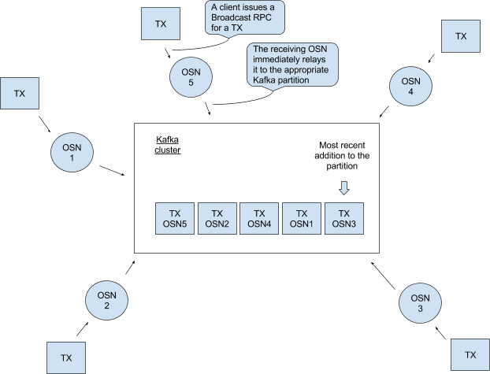



原文：<https://docs.google.com/document/d/1vNMaM7XhOlu9tB_10dKnlrhy5d7b1u8lSY8a-kVjCO4/edit>

翻译：[梧桐树](https://wutongtree.com)

## 简介
我们使用Kafka以容错的方式为多链条提供排序服务。排序服务包括带有相应ZooKeeper集成的Kafka集群，和排序服务client与Kafka集群之间的一组排序服务节点（见图1）。

图1 	一个排序服务包含5个排序服务节点（OSN-n）和一个Kafka集群。排序服务client可以连接到多个OSN，但OSN之间不能互相通信。

OSN有如下功能：

1. 对client认证；
2. 允许使用简单的接口读写chain（指一组clien(即一个channel)访问的log）
3. 对chain的配置交易（创建chain或者对既存的chain重新配置）进行过滤和验证

## 如何应用的kafka
Kafka中的消息写在一个topic partition中，一个Kafka集群可有多个topic，每个topic可有多个partition（见图2）。partition是一个不断有消息加入的、有序的、不可变的消息序列。

图2		一个topic包含3个partition，partition中的每个消息都标记一个offset。

***译注：交易过程是 client-->endorse-->client-->ordering-->commit-->ledger；以下方案应该都是对于ordering-->commit这一步的，研究每个OSN如何取到相同的交易序列生成一个block传给commit***

### 方案0
假设对于每个chain都有一个单独的partition（这些分区是否属于同一个topic是个与此主题无关的实现细节）。当OSN执行client认证和交易过滤时，就会将属于某个chain的来自于client的交易放到该chain对应的partition中，然后OSN就可以利用partition获取到交易的有序列表。

图3		假设所有的client交易属于相同chain，OSN将这些client交易放到Kafka集群的同一partition中，然后所有的OSN就可以从该partition中读取到相同的交易序列。

假设每个client交易都是一个单独的block。读取partition后，OSN以Block类型打包交易，并为之分配一个等于Kafka集群中offset的序号，然后为此block签名（为了可审计）发给client。其实就是在该partition上设置一个Kafka consumer为client提供可查询指定block或offset的RPC服务。

这样当然可以，但有问题：考虑到交易频率*（译注：应该是交易的进入partition的速度）*，比如每秒1k个交易，排序服务就需要每秒生成1k个签名，而client就必须能够每秒验证1k个签名。由于签名与校验很费时，所以这样处理很困难。

### 方案1
用批量处理代替每个交易单独block。对于上面的例子，假设1k个交易算作一批，那么排序服务只需为这一批交易生成一个签名，client也只需要验证一个签名。

这样会好一些，但还是有问题：如果交易的频率不固定呢？假设排序服务刚刚发出了一批1k个交易，现在有999个交易在内存中等待一个交易凑成一批，但在接下来的一小时内排序服务没收到任何交易，那么对于那999个交易来说等待一小时是不可接受的。

### 方案2
所以我们考虑需要一个批量定时器。当最新的一批开始时设置一个定时器，当达到block可含交易最大量（batchSize）或者定时器到期（batchTimeout）时（以先满足者为准），就打包一个block。这就解决了`方案1`中999个交易的问题，确保block可以及时处理。

但该方案依然有问题：基于定时器的方法需要服务节点之间的协调。基于消息数量的block打包方式很简单--从partition读取2（batchSize=2）个消息（也就是partition中的交易），直接打包成block，这个partition的读取对于所有的OSN来说都是相同的，所以就可以保证无论client连接哪个OSN都可以获得相同消息序列的block。现在设batchTimeout=1s，2个OSN，一批交易刚被打包，一个新的交易通过OSN1进入partition。OSN2在t=5s时刻读到这个新的交易并设置定时器t=6s时刻触发，OSN1在t=5.6s时刻读到这个交易并设置了自己的触发器。第二个交易放到partition后，OSN2在t=6.2s时刻读到，OSN1在t=6.5s时读到。现在OSN1 block中由2个交易，而OSN2 block中有1个交易，两个OSN输出的是不同的block交易序列，这显然是不可接受的。*（译注：也就是说即便定时器相同，读取时间不同，读到的内容也会不同）*

### 方案3
所以基于定时器的打包block方式需要明确的协调信号。假设，每个OSN在打包block之前都给partition发一个“time to cut block X”（以下简称TTC-X）消息（其中X是对应于序列中写一个block的整数），直到从partition中首次读到TTC-X消息（注意，这个TTC-X不一定非得是某个OSN自己发的那个，如果每个OSN都等自己的TTC-X的话，还是会跟`方案2`一样产生错误结果）才会真正打包一个block。每个OSN都会在batchSize满足或者读到第一个TTC-X消息时（以先发生者为准）才会打包block X。这就意味着打包了block X后，后续所有的TTC-X（X要相同）消息都会被OSN忽略。图4展示了一个示例

图4		OSN将交易和TTC-X放入partition

这样就能保证所有OSN取到的block序列一致了。但是因为每个block中不是只有一个交易了，所以block号也就不能转换为Kafka中该partition里的offset。因此排序服务收到一个以某block开始的查询请求时，比如说5，就不知道block中交易在partition里的offset是多少。

### 方案4a
我们可以使用Block类型中的Metadata字段来记录该block所包含的交易的offset（例如，图4中block4的Metadata可以是“offsets: 63-64”)。如果正在访问block9的client想从block5开始获取一系列数据，它会发送一个开始数=65的Deliver请求，OSN收到请求后会从offset=65开始重新遍历partition log并根据batchSize和TTC-X（其中X对于上一个打包的block的序号）来打包block（注意，理论上client可以发送一个不是某block起始tx的offset，这样OSN就会返回错误序列）。这会有两个问题，一是使用block序号作为参数违反了 Deliver API协议；二是如果client丢失一堆block，并且只是想去一个随机的block x（没有/丢失 block x-1）或者最新的block（通过设置RPC消息的NEWEST参数实现）会发生什么呢？Client不知道传递的offset是否正确，OSN也无法确定收到的offset是否正确。

### 方案4b
因此每个OSN需要为每个chain维护一个block序号与block中第一个tx的offset映射关系表（如表1）。这就意味着只有OSN维护的table里包含了请求的block序号，才能处理这个Deliver请求。

| Block Number | Offset Number |
| --- | ---- |
| ... | ... |
| 4 | 63 |
| 5 | 65 |
| ... | ... |

表1		与图4对应的映射表

这个映射关系表消除了对metadata字段的需求，并使client可以发送正确的offset Deliver请求，OSN收到请求后就可将请求的block序号转换为正确的offset来查找。

但是有两个问题，一是，每当OSN收到Deliver请求，它都会从请求的block序号开始（上表中的63或65）从partition中检索消息，然后将之打包为block并为之签名。重复这Deliver请求时就会重复打包和签名操作，这会很浪费很耗时；二是，由于partition中有许多需要跳过的冗余数据，查找请求的offset，重放所有记录，映射表还需要被随时查询，这样导致deliver逻辑变得越发复杂，查询映射表也会增加延迟。

为了解决第一个问题，我们可以将创建的block保留下来，当再次需要时，直接拿来用就可以了。

### 方案5a
假设我们目前为止一直引用的partition为partition0，在创建一个partition称为partition1。每当OSN从partition0中打包出一个block就放入partition1，之后所有的Deliver请求都在partition1上处理。由于每个OSN都将自己的block放入partition1中，所以partition1中的block序列就不能直接转换为精确的chain序列，还有重复的block，更一般地说，所有OSN的block序号不是严格递增的。如图5

图5		partition1的一种可能状态。最近的消息被追加到右侧，注意所有的OSN的block序号不是严格递增的（3-3-1-2-2-4），但是每个单独的OSN的block序号却是递增的（例如OSN4的1-2）

这就意味着Kafka分配的offset不能映射到OSN分配的连续的block序号，所以就需要在维护一个像上面的解决方案似得block与offset的映射表。见表2

| Block Number | Offset Number |
| --- | ---- |
| ... | ... |
| 3 | 3 |
| 4 | 8 |
| ... | ... |

表2		根据图5得到的partition中的映射表。假设partition1中的第一个block3是图5中第一个捕获到的block，与表1的区别是此处的offset是指在partition1中block的offset，而不是指在partition0中tx的offset。

这只解决了`方案4b`中的第一个问题。OSN中Deliver逻辑复杂，对于每个请求都需要查表的问题依然存在。

### 方案6
是什么导致消息冗余呢？partition0中的TTC-X消息（见图4）或者partition1中小于或等于较早消息的“Block X”消息（图5中所有的中间消息都小于等于最左边的block3）。那么如何解决冗余问题呢？

### 方案6a
首先设一条规则：当要将消息放到partition中时，如果该partition已经收到过相同的消息（除去签名），那么就放弃该操作。然后回到图5的例子，如果OSN1打包自己的block3时发现partition1中已经有来自于OSN2的block3了，它就会再将自己的block3放到partition1中了。（该描述也同样适用于图4的partition0）虽然这样肯定会减少重复消息，但不能完全消除。肯定会有不同OSN在同一时间将同样的block放到partition中，或者相同的block出现在Kafka broker set中这样的情况。

### 方案6b
如果有一个主OSN独自负责将block放到partition1中呢？有几种选出主OSN的方式：例如可以让左右OSN在ZooKeeper上竞争znode，或者第一个在partition0中发布TTC-X消息的节点。还有个方法是让所有的OSN属于同一个consumer组，这就意味着在一个topic中每个OSN拥有自己的partition。（假设一个包含所有chain总所有partition-0的topic，和一个包含多有partition-1的topic。）然后主OSN负责向partition-0中发送TTC-X或者向partition-1中发送block。（向不拥有某chain或partition的OSN发送Deliver请求，将会在后台重定向到合适的OSN.）

这种方式可以运行，但是如果主OSN向partition1发送了Block X消息后就崩溃了，会发生什么呢？这个消息仍在路有种还未被放到partition1内。OSN们意识到主OSN宕掉并选出新的主OSN，新的主OSN发现Block X还在缓冲区并未进入partition1，就把它放到partition1中。至此，原主OSN的block X终于进入了partition1，这一过程的顺序见图6

图6		主OSN并不能消除重复消息

### 方案6c
log压缩可以确保Kafka的partition里保留每个消息的最后一个值（记录在kafka中是键值对，即每个key都保留一个最新的value），如图7

图7		kafka中的log压缩

如果使用这种方式当然可以消除partition里的重复项，当然前提是所有的Block X的key相同，不同的X对应的key不同。使用图7的示例，假设列出的key映射到block，仅接收到partition中前两个消息的OSN维护了一个映射表，其中block1对应offset0，block2对应offset1。之后这个partition被压缩成图7下半部分的样子，此时使用offset1或0就会出错。同样重要的，log压缩后block在partition1中不是以升序存储的（如图7下半部分的序列是1-3-4-5-2-6），所以Deliver逻辑依然复杂。实际上log压缩的方式显然没法解决映射表过期问题。

所以这个方案依然没有解决`方案4b`中的第二个问题，现在回到另一个问题：将block持久化（方案5a）

## 方案5b
取代`方案6a`那种使用另外一个partition的方式，只使用partition0存放tx和TTC-X，然后在本地为每个chain维护一个log。如图8

图8		设计提案。为了简单，我们假设所有的交易属于同一chain，但是真正设计时要适用于多chain

这具有以下优点：

一，解决了`方案4b`中的第二个问题。**方案6d：**Deliver请求只需从本地ledger顺序读取。（因为OSN写入本地log时会过滤所以没有冗余数据，而且不用查表。OSN需要保持跟踪他最后读取的一个offset，以便Kafka重连时知道从哪寻找位置）

二，最大限度利用了orderer代码中的通用组件，Deliver路径在所有现有实现上基本相同。

以本地ledger服务Deliver请求有个缺点是比直接从Kafka处服务要慢，但是我们也从来没使用Kafka服务，毕竟总会有些处理要发生在OSN上的。

具体的，如果说到重放请求，`方案6d`仍然需要在OSN上做一些处理（无论是在4b还是5a中打包和查表），在其他无ledger的方案中也同样存在此问题。

如果说到Deliver请求保持当前状态（想当于'tail -f'），`方案6d`相比较`方案4b`会多出存储block到本地ledger和从本地ledger获取服务两部分。

在`方案5a`中，block需要通过partition1做第二次往返，在有些环境中可能比`方案6d`更差。

